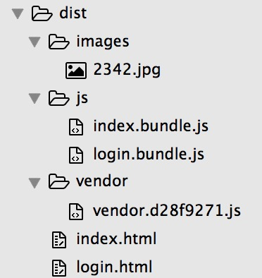

# webpack

**entry 多入口** 就是针对不同的页面加载不同的bundle.js，如登录页就只加载login.bundle.js,而首页则加载index.bundle.js  
下面我们来做个试验~ ~

## 项目结构


## 配置文件

```
var webpack = require('webpack');
var HtmlWebpackPlugin = require('html-webpack-plugin');
var path = require('path');

var CommonsChunkPlugin = webpack.optimize.CommonsChunkPlugin;
var UglifyJsPlugin = webpack.optimize.UglifyJsPlugin;

// 先定义俩入口文件
var entries = {index:'./index/index.js', login:'./login/index.js'}

// 配置生成入口文件的html,加载不同的js
var plugins = []
for (var plugin in entries){
  plugins.push(new HtmlWebpackPlugin({
    title:'webpack home', 
    template:'./index.html', 
    filename:plugin + '.html', 
    chunks:['vendor',plugin], 
    inject: 'body'
  }))
}
// 提取公共部分
plugins.push(new CommonsChunkPlugin({filename: "[name]/[name].[hash:8].js", name:'vendor'}))
// 混淆压缩
plugins.push(new UglifyJsPlugin({compress: {warnings: false } }))

module.exports = {
    // entry 可以为：字符串，数组，对象，其值是入口文件的 相对路径
    entry: entries,
    output: {
      path:'./dist',
      filename: 'js/[name].bundle.js'       // 这里的name为entry的key值,即index,login
    },
    reslove:{
      root: __dirname,
      extensions : ['','.js']
    },
    module: {
      loaders: [
        { test: /\.css$/, 
          loader: "style!css" 
        },
        // https://www.npmjs.com/package/file-loader
        // name 属性定义了输出文件名，可包含输出路径
        { test: /\.(jpe?g|png|gif|ico)/i,
          loader: 'file?name=images/[name].[ext]'
        }, 
        // 类似file-loader ,但返回值为：Data Url
        // https://www.npmjs.com/package/url-loader
        { 
          test: /\.(woff|svg|eot|ttf)\??.*$/, 
          loader: 'url-loader?limit=30000'
        },
      ]
    },
    plugins: plugins
};

```