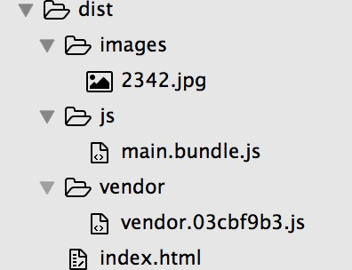
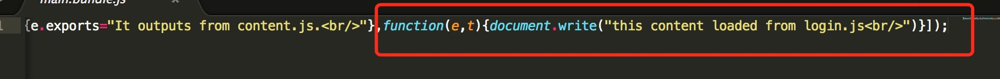

# webpack

[Webpack — The Confusing Parts](https://medium.com/@rajaraodv/webpack-the-confusing-parts-58712f8fcad9#.f0cdf0reg)

**multiple entry：数组模式**  

`使用数组的模式是将多个相互无依赖的模块（文件），追加到一个bundle文件末尾`

## 结构
目录  
   
bundle文件  


## 配置文件

```
var webpack = require('webpack');
var HtmlWebpackPlugin = require('html-webpack-plugin');
var path = require('path');

module.exports = {
    // entry 可以为：字符串，数组，对象，其值是入口文件的 相对路径
    // https://medium.com/@rajaraodv/webpack-the-confusing-parts-58712f8fcad9#.f0cdf0reg
    // 为数组的意思
    // if you want to append multiple files that are NOT dependent on each other, you can use the Array format.
    // 使用数组的模式是将多个相互无依赖的模块（文件），追加到一个bundle文件末尾
    // For example: you may need ./login/index.js” in your HTML. You can tell Webpack to append it to the end of the bundle.js
    // 如本例中添加了一个login/index.js到bundle末尾
    entry: [
    './index/index.js','./login/index.js'
    ],
    output: {
      path:'./dist',
      filename: 'js/[name].bundle.js'
    },
    reslove:{
      root: __dirname,
      extensions : ['','.js']
    },
    module: {
      loaders: [
        { test: /\.css$/, 
          loader: "style!css" 
        },
        // https://www.npmjs.com/package/file-loader
        // name 属性定义了输出文件名，可包含输出路径
        { test: /\.(jpe?g|png|gif|ico)/i,
          loader: 'file?name=images/[name].[ext]'
        }, 
        // 类似file-loader ,但返回值为：Data Url
        // https://www.npmjs.com/package/url-loader
        { 
          test: /\.(woff|svg|eot|ttf)\??.*$/, 
          loader: 'url-loader?limit=30000'
        },
      ]
    },
    plugins: [
      new HtmlWebpackPlugin({
        title:'webpack home', 
        template:'./index.html', 
        inject: 'body'
      }),
      new CommonsChunkPlugin({
        filename: "[name]/[name].[hash:8].js", 
        name:'vendor'
      }),
      new UglifyJsPlugin({
        compress: {
          warnings: false 
        } 
      })
    ]
};
```