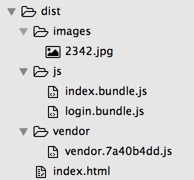
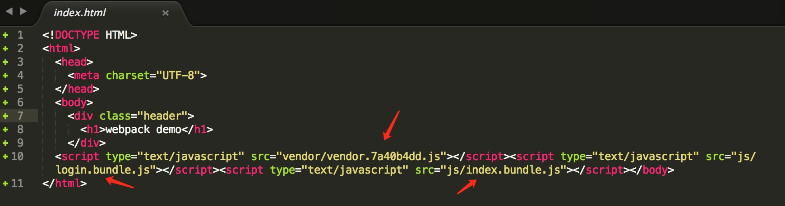

# webpack

[Webpack — The Confusing Parts](https://medium.com/@rajaraodv/webpack-the-confusing-parts-58712f8fcad9#.f0cdf0reg)

**multiple entry：对象模式**  

`主要应用于多页面的的应用中，他会将每个入口文件打包成单独的bundle文件`

## 结构
目录  
   
html文件  


## 配置文件

```
var webpack = require('webpack');
var HtmlWebpackPlugin = require('html-webpack-plugin');
var path = require('path');

module.exports = {
    // entry 可以为：字符串，数组，对象，其值是入口文件的 相对路径
    // https://medium.com/@rajaraodv/webpack-the-confusing-parts-58712f8fcad9#.f0cdf0reg
    // 为对象的方式
    // let’s say you have true multi-page application, not a SPA w/ multi-views, 
    // but with multiple HTML files (index.html and profile.html). 
    // You can then tell Webpack to generate multiple bundles at once by using entry object.
    // 主要应用于多页面的的应用中，他会将每个入口文件打包成单独的bundle文件
    entry: {
      index:'./index/index.js',
      login:'./login/index.js'
    },
    output: {
      path:'./dist',
      filename: 'js/[name].bundle.js'
    },
    reslove:{
      root: __dirname,
      extensions : ['','.js']
    },
    module: {
      loaders: [
        { test: /\.css$/, 
          loader: "style!css" 
        },
        // https://www.npmjs.com/package/file-loader
        // name 属性定义了输出文件名，可包含输出路径
        { test: /\.(jpe?g|png|gif|ico)/i,
          loader: 'file?name=images/[name].[ext]'
        }, 
        // 类似file-loader ,但返回值为：Data Url
        // https://www.npmjs.com/package/url-loader
        { 
          test: /\.(woff|svg|eot|ttf)\??.*$/, 
          loader: 'url-loader?limit=30000'
        },
      ]
    },
    plugins: [
      new HtmlWebpackPlugin({
        title:'webpack home', 
        template:'./index.html', 
        inject: 'body'
      }),
      new CommonsChunkPlugin({
        filename: "[name]/[name].[hash:8].js", 
        name:'vendor'
      }),
      new UglifyJsPlugin({
        compress: {
          warnings: false 
        } 
      })
    ]
};
```